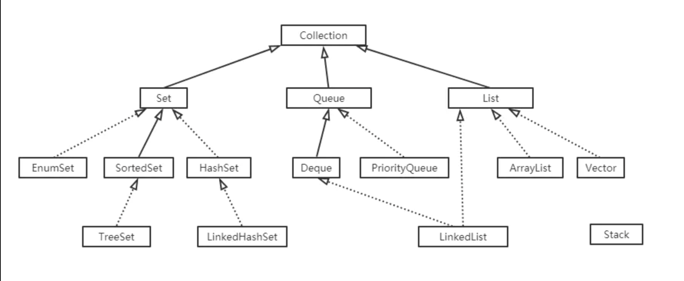

## TreeSet

特征：有序，去重

TreeSet是基于TreeMap实现的，TreeSet的元素支持2种排序方式：自然排序或者根据提供的Comparator进行排序。



要对自定义的对象进行排序，则要实现`implements Comparable<T>`接口，并重写接口中的compareTo方法。

也可以自定义排序方式。

```java
//定义一个类，实现Comparator接口，并重写compare()方法，
class CompareByLength implements Comparator<String> {

    @Override
    public int compare(String s1, String s2) {        //按照字符串的长度比较
        int num = s1.length() - s2.length();        //长度为主要条件
        return num == 0 ? s1.compareTo(s2) : num;    //内容为次要条件
    }
}


TreeSet<String> ts = new TreeSet<>(new CompareByLen());   
```

## ASCII码

48～57为0到9十个阿拉伯数字，65～90为26个大写英文字母，97～122号为26个小写英文字母

## IP地址

所有的IP地址划分为 A,B,C,D,E五类

A类地址1.0.0.0~126.255.255.255;

B类地址128.0.0.0~191.255.255.255;

C类地址192.0.0.0~223.255.255.255;

D类地址224.0.0.0~239.255.255.255；

E类地址240.0.0.0~255.255.255.255


私网IP范围是：

10.0.0.0～10.255.255.255

172.16.0.0～172.31.255.255

192.168.0.0～192.168.255.255

